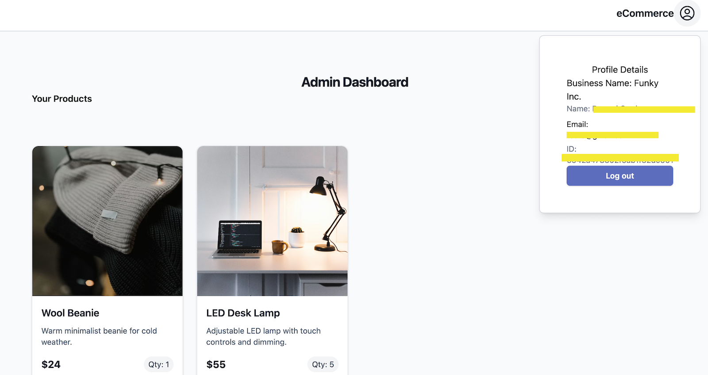

# ShopNest — Frontend

Frontend application for **ShopNest**, a full-stack e-commerce web app.  
Built with **React (Vite)** and **Tailwind CSS**, and designed to work with a session-based backend API.

This repository focuses on **UI state management, routing, and frontend–backend integration**, while core business logic and data integrity are handled by the backend.

---

## Overview

The ShopNest frontend provides the user interface for two primary experiences:

- **Customers / Clients** can browse products and manage a shopping cart without creating an account.
- **Merchants / Sellers** can authenticate and manage their product listings.

The frontend is intentionally **stateless with respect to business logic**. It reflects backend state and validations rather than duplicating them client-side.

**Live deployment:** The frontend is deployed on **Vercel**.
- **Live URL:** https://shopnest-frontend-tan.vercel.app/

> Note: This service is hosted on a free tier. The first request after inactivity may experience a brief cold start.

---

## Current Feature Set

### Customer / Client
- Browse available products
- Add and remove items from a shopping cart
- Cart state persists across sessions
- UI reflects inventory constraints enforced by the backend

### Merchant / Seller
- Authentication UI (sign up / sign in)
- Session-aware navigation and views
- Product management interface (paired with backend CRUD operations)
- Real-time feedback via notifications for success and error states

---

## Tech Stack

### Core
- **React** (with Vite)
- **React Router DOM** (client-side routing)
- **Tailwind CSS** (utility-first styling)
- **Axios** (API communication)

### UI & Tooling
- **Heroicons** (icons)
- **ESLint** (linting)

---

## State Management Approach

Global state is handled using **React Context Providers**, composed at the root of the application.

Each provider has a focused responsibility:
- **MerchantAuthContext** – authentication and session-aware merchant state
- **CartContext** – shopping cart state and persistence
- **NotificationContext** – user feedback and UI messaging

This approach avoids prop-drilling while keeping state responsibilities explicit and isolated.

---

## Routing

Client-side routing is handled with **React Router**.

- Public routes are accessible without authentication
- Authenticated routes adapt based on session state
- Navigation updates automatically in response to backend authentication status

---

## Backend Integration

The frontend communicates with the backend via **Axios** and is designed to work with **cookie-based session authentication**.

Key considerations:
- Requests are configured to support credentials when required
- Frontend behavior assumes the backend is the source of truth
- Validation errors and success responses are surfaced directly to users via UI notifications

Backend Github repo URL: https://github.com/Miguel-Venegas/shopnest-backend

---

## Roadmap

Planned improvements and refinements:

- Add product search with filters
- Implement an autocomplete search component
- Fix Safari/iOS browser issues related to cookies and CORS
- Improve cart update responsiveness
- Fix edge case where items can be added when stock is exhausted

## Authentication Flow

Secure sign-in and account creation using a consistent interface.

